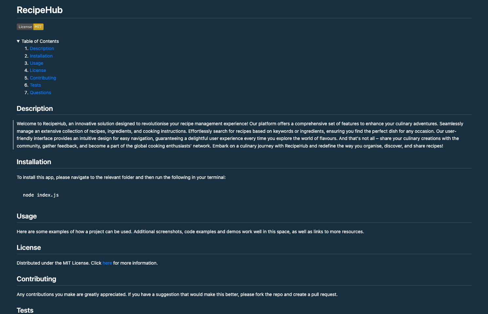

# README Generator
Module 11 Challenge for EDX Bootcamp

<!-- TABLE OF CONTENTS -->

  
Table of Contents

  <ol>
    <li>
      <a href="#description">Description</a>
      <ul>
        <li><a href="#built-with">Built With</a></li>
        <li><a href="#dependencies">Dependencies</a></li>
      </ul>
    </li>
    <li>
        <a href="#installation">Installation</a>
    </li>
    <li><a href="#usage">Usage</a></li>
    <li><a href="#license">License</a></li>
    <li><a href="#contact">Contact</a></li>
    <li><a href="#acknowledgments">Acknowledgments</a></li>
  </ol>

<!-- ABOUT THE PROJECT -->
## Description

 
 
This was the 11th homework challenge for the EDX Bootcamp in Front End Development.
 

   
Our task was to build a README generator that runs on the server using Node.js. The app retrieves data based on user input using the Inquirer package and then writes that data to a README file that can be found in the output folder.

 

### Built With

* 
* 

### Dependencies

* Inquirer version 8.2.4

## Installation

  To install this app, please open the index.js file in the integrated terminal and then type the following in your terminal:
~~~sh
node index.js
~~~

<!-- USAGE EXAMPLES -->
## Usage

To use this project, first right click the index.js file and select 'Open in Integrated Terminal' from the popup menu. 

You will be prompted with several questions about your project, such as Title, Description, License, Usage, Installation etc.

Most questions are simple inputs, but some are lists, such as the License question. Some questions also require answers, such as Title and Description, whereas other questions like Testing and Contributing can be skipped by pressing enter. This will add 'N/A' to that section in the README file. 

Once you have added all your information you will be shown a success message, and a README.md file will be generated in the output folder.

<!-- LICENSE -->
## License

Distributed under the MIT License. See `LICENSE.txt` for more information.

<!-- CONTACT -->
## Contact

Richard Llewellyn - richard.lee.llewellyn@gmail.com 

Sample README file: [https://github.com/RichLlew182/readme-generator](https://github.com/RichLlew182/readme-generator)

Video Presentation Link: [https://richllew182.github.io/weather-dashboard/](https://richllew182.github.io/weather-dashboard/)

Project Repo Link: [https://github.com/RichLlew182/readme-generator](https://github.com/RichLlew182/readme-generator)

<!-- ACKNOWLEDGMENTS -->
## Acknowledgments

* [Img Shields](https://shields.io)
* [Best README Template](https://github.com/othneildrew/Best-README-Template)
